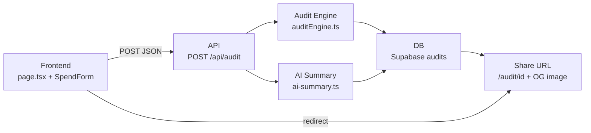
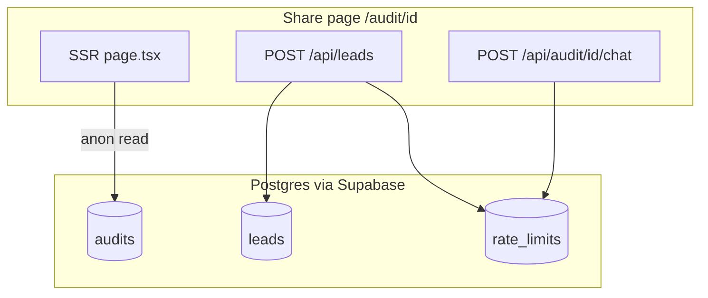
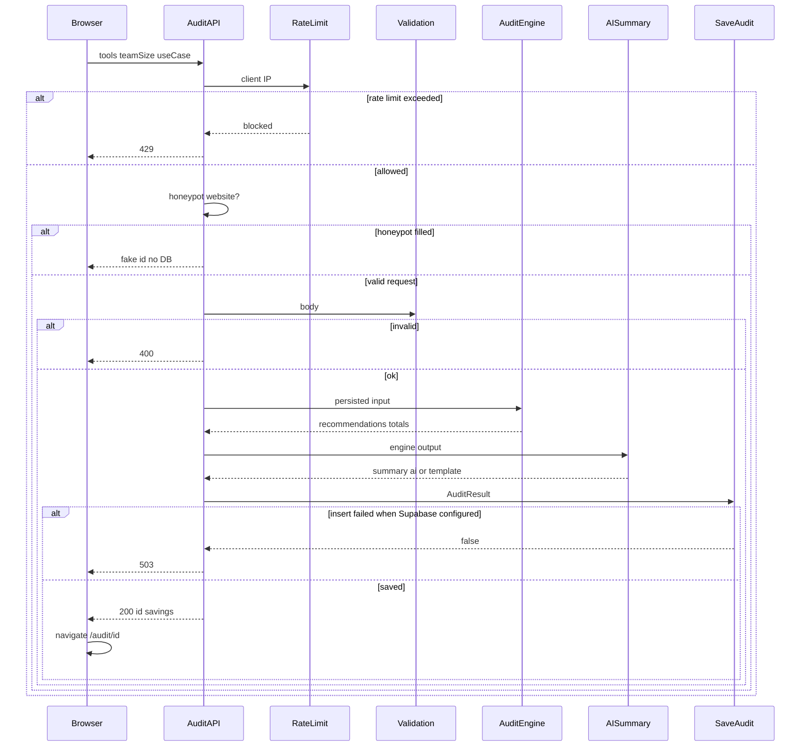
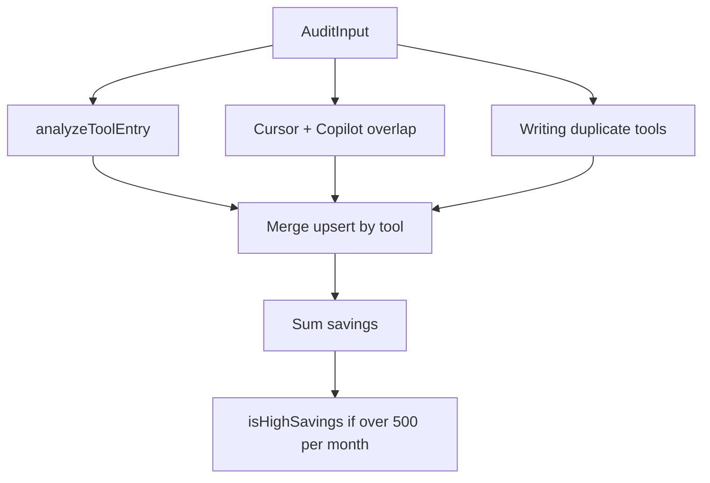
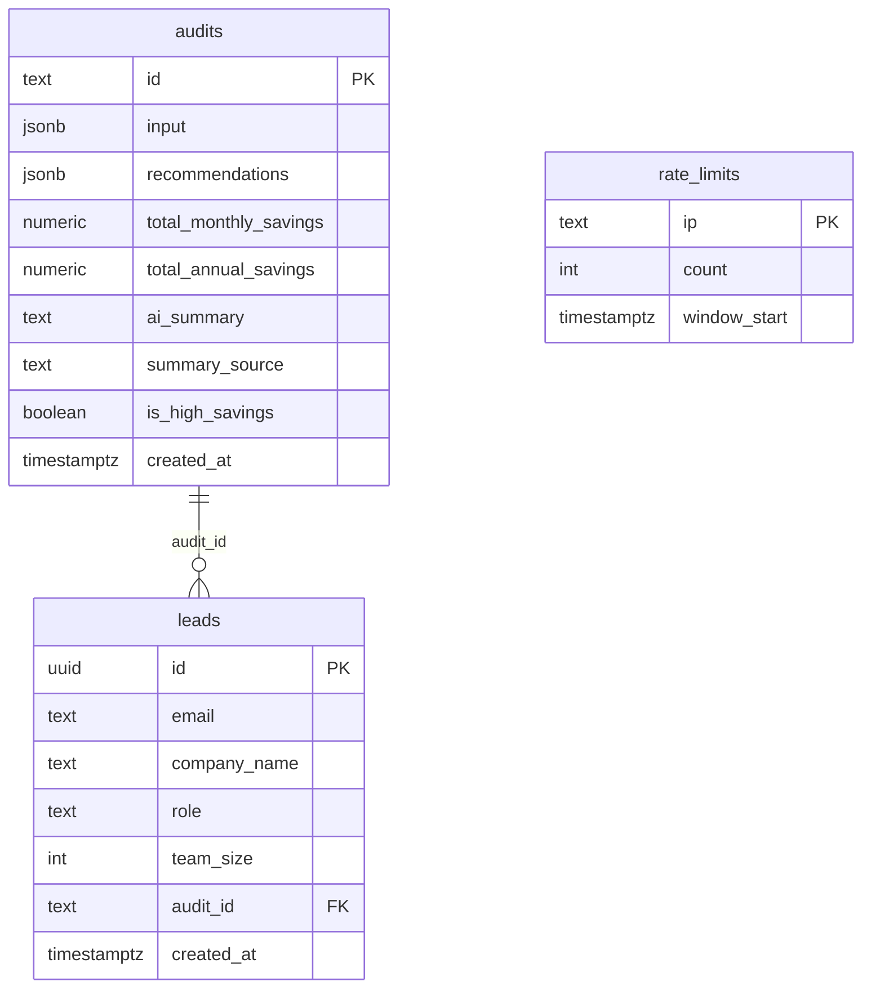

# SpendSense Architecture

SpendSense is a free, no-login AI tool spend audit for startups. A visitor describes their stack on the landing page; the server runs a **deterministic rules engine** for every dollar of savings, optionally asks OpenAI for a short narrative paragraph, persists the result in Supabase, and serves a **public share URL** with dynamic Open Graph previews. Email capture happens **after** the full report is shown.

**Technical deep-dives** live in [`docs/`](docs/README.md) (API, audit engine, security, deployment, etc.). **Mermaid diagrams** render on GitHub; **ASCII diagrams** below always display in plain text.

---

## Purpose (for reviewers)

This document is the primary engineering artifact for the assignment. It is meant to show three things:

| What graders look for | How this doc demonstrates it |
|----------------------|--------------------------------|
| **Systems thinking** | End-to-end path from browser → API → rules engine → database → share URL, with explicit boundaries between deterministic math and AI narrative. |
| **Scalability thinking** | Section D answers “what changes at 10,000 audits/day?” with caching, queues, indexing, CDN, rate limits, and serverless tradeoffs tied to real tables and routes. |
| **Code organization maturity** | Clear module ownership (`auditEngine.ts` vs `ai-summary.ts` vs `supabase.ts`), typed domain models, RLS posture, and a key-files appendix aligned to the repo layout. |

**Rubric map**

| Required section | Location in this doc |
|------------------|----------------------|
| A. System diagram | [Section A](#a-system-diagram) |
| B. Data flow | [Section B](#b-data-flow) |
| C. Why stack chosen | [Section C](#c-why-stack-chosen) |
| D. Scaling (10k audits/day) | [Section D](#d-scaling-discussion--10000-audits-per-day) |
| Audit engine deep dive (elite) | [Audit engine deep dive](#audit-engine-deep-dive) |
| AI boundaries (elite) | [AI boundaries](#ai-boundaries) |

---

## A. System diagram

The product is one synchronous “create audit” path plus read-heavy share pages. Financial logic never leaves the rules engine; AI only adds prose.

### ASCII — primary (always visible)

Graders and plain-text viewers see this path without any renderer:

```text
┌─────────────────────────────────────────────────────────────────┐
│  FRONTEND (Browser)                                              │
│  Landing page + SpendForm (tools, plans, seats, spend, team)     │
└───────────────────────────────┬─────────────────────────────────┘
                                │ POST JSON
                                v
┌─────────────────────────────────────────────────────────────────┐
│  API — POST /api/audit                                           │
│  rate limit → honeypot → validate → strip honeypot from payload    │
└───────────────────────────────┬─────────────────────────────────┘
                                │
              ┌─────────────────┴─────────────────┐
              v                                   v
┌──────────────────────────┐        ┌──────────────────────────────┐
│  AUDIT ENGINE            │        │  AI SUMMARY (optional)        │
│  runAudit(auditEngine.ts)│        │  generateAISummary            │
│  ALL savings $ math      │        │  paragraph only; no $ changes │
│  uses pricing.ts         │        │  OpenAI or template fallback  │
└──────────────────────────┘        └──────────────────────────────┘
              │                                   │
              └─────────────────┬─────────────────┘
                                v
┌─────────────────────────────────────────────────────────────────┐
│  DB — saveAudit → Supabase table `audits`                        │
│  (in-memory Map in local dev / Playwright e2e only)              │
└───────────────────────────────┬─────────────────────────────────┘
                                │ JSON { id, savings... }
                                v
┌─────────────────────────────────────────────────────────────────┐
│  SHARE URL — GET /audit/{id} (SSR, revalidate 3600)              │
│  recommendations + AI paragraph + OG metadata + OG PNG image       │
│  optional: LeadCapture → POST /api/leads → `leads` table          │
│  optional: AuditChatWidget → POST /api/audit/{id}/chat           │
└─────────────────────────────────────────────────────────────────┘
```

**Linear summary (assignment checklist):**

`Frontend` → `API` → `Audit Engine` → `AI Summary` → `DB` → `Share URL`

### Mermaid — system overview



### Mermaid — supporting APIs (same deployment)



### Mermaid — audit creation sequence



---

## B. Data flow

Plain-language path from landing to shareable report.

### Happy path (numbered)

1. **User input** — Visitor adds tools (Cursor, Claude, ChatGPT, etc.), plans, monthly spend, seats, plus team size and use case on [`SpendForm`](src/components/spend-form/spend-form.tsx). Draft persists in `localStorage`. Hidden honeypot field `website` stays empty for real users.

2. **Validation** — `POST /api/audit` receives JSON. [`validateAuditInput`](src/lib/validation.ts) checks: at least one tool, known tool/plan from [`pricing.ts`](src/lib/pricing.ts), no duplicate tools, `teamSize ≥ 1`, valid `useCase`. Honeypot `website` is stripped via `toPersistedAuditInput` before storage.

3. **Audit generation** — [`runAudit`](src/lib/auditEngine.ts) computes every recommendation and all dollar totals. No LLM involved.

4. **AI summary** — [`generateAISummary`](src/lib/ai-summary.ts) builds a ~100-word paragraph from engine outputs only. OpenAI if `OPENAI_API_KEY` is set; otherwise deterministic template. **Totals do not change** after this step.

5. **DB storage** — [`saveAudit`](src/lib/supabase.ts) inserts into `audits` (service role). Assigns `nanoid(10)` id. Response: `{ id, totalMonthlySavings, totalAnnualSavings, isHighSavings }`.

6. **Share page** — Client navigates to `/audit/{id}`. Server Component loads audit via `getAudit` (anon RLS read), renders hero, stack health, per-tool cards, AI paragraph, Credex CTA or honest path, lead form **below** value, share buttons, dynamic OG tags and PNG.

### Guards and failure modes

| Step | What happens | HTTP |
|------|----------------|------|
| Rate limit | `checkRateLimit(ip)` — 10 POSTs per IP per hour on `rate_limits` (audits + leads share bucket) | 429 |
| Rate limit DB down in **production** | Fail **closed** (deny request) | 429 |
| Rate limit DB down in **dev** | Fail **open** (allow request) | — |
| E2E / Playwright | `E2E_SKIP_RATE_LIMIT=1` disables rate limit; allows in-memory persistence on `next start` | — |
| Honeypot | Non-empty `website` → fake id, zero savings, **no DB write** | 200 (decoy) |
| Invalid input | Unknown tool/plan, empty stack, etc. | 400 |
| Supabase insert fails when configured | No shareable id returned | 503 |
| No Supabase in dev | Audit stored in process memory Map only | 200 |

### After the share page

- **Lead capture** — `POST /api/leads` after user sees savings; same rate limit; honeypot `phone`; optional Resend email.
- **Audit chat** — `POST /api/audit/[id]/chat` answers questions about **saved** audit context; does not recompute savings or write to DB.

---

## C. Why stack chosen

Choices are tied to this product (one-shot audit → share → email), not “because popular.”

### Next.js 14 (App Router)

- **One repo** for marketing landing, API route handlers, and SSR audit pages — no separate backend service to deploy.
- **Route Handlers** keep `OPENAI_API_KEY`, `SUPABASE_SERVICE_ROLE_KEY`, and `RESEND_API_KEY` on the server only.
- **SSR on `/audit/[id]`** gives every audit a stable, crawlable share URL; link unfurlers (Slack, X, LinkedIn) get real HTML.
- **`revalidate = 3600`** on the audit page caches immutable reports at the edge — important when a viral post drives thousands of revisits to the same id.
- **`opengraph-image.tsx`** generates per-audit PNG previews without a separate image microservice.

**Maintainability:** File-based routing maps directly to user journeys (`/`, `/api/audit`, `/audit/[id]`).

### Supabase (Postgres + RLS)

- **Postgres** fits structured audits (`input` JSONB, `recommendations` JSONB, numeric savings) and relational leads (`audit_id` FK).
- **RLS:** `audits` are **public read** for share URLs without building auth. `leads` and `rate_limits` have no public policies — writes only via service role in API routes.
- **No custom auth** for a free tool — anon key + service role is enough for MVP.

**Maintainability:** Schema in [`supabase/schema.sql`](supabase/schema.sql); one admin client for writes, one anon client for reads.

### TypeScript (strict)

- Audit logic is branching financial rules (seat minimums, plan tiers, overlap). Types for `AITool`, `RecommendationType`, and `ToolRecommendation` catch invalid plans at compile time and in validation.
- API payloads and engine outputs share [`src/types/index.ts`](src/types/index.ts) — refactors stay safe.

**Maintainability:** 80+ Vitest tests; engine and pricing tests lock behavior.

### Tailwind CSS + shadcn/ui

- Utility-first styling for a single-product landing + report UI without a separate design system repository.
- Tokens in [`globals.css`](src/app/globals.css) (`text-savings`, display fonts) keep brand consistent.
- Responsive layout for mobile audit reports (stacked cards, full-width modals) without bespoke CSS files per page.

**Maintainability:** Components colocated under `src/components/` by feature (audit, spend-form, layout).

### What we did not optimize for

Multi-tenant dashboards, real-time collaboration, or native mobile apps — the funnel is audit → share → optional email.

---

## D. Scaling discussion — 10,000 audits per day

Rough load: ~7 audits/minute average, with spikes of 50+/minute from HN or X. The current architecture is correct for launch (synchronous `POST /api/audit`, Postgres rate limits, Vercel serverless). At **~10k audits/day**, change these areas:

### Caching

| Layer | Today | At scale |
|-------|-------|----------|
| Audit page | `revalidate = 3600` on `/audit/[id]` | Add `Cache-Control: public, s-maxage=3600, stale-while-revalidate=86400` on successful SSR responses |
| OG images | Per-audit `opengraph-image` route | Ensure CDN caches PNG responses for repeat unfurls of the same id |
| Engine output | Recomputed every POST | Optional: cache `runAudit` result by hash of `(tools, teamSize, useCase)` for 24h to cut CPU on duplicate submissions |

Reads dominate after a viral share — caching the share URL is the highest ROI change.

### Indexing

| Table | Index / action |
|-------|----------------|
| `audits` | `audits_created_at_idx` on `created_at DESC` (exists). Monitor insert p95. Partition by month after ~100k rows. |
| `leads` | Index `(audit_id)`; unique `(audit_id, email)` for idempotent capture |
| `rate_limits` | Primary key on `ip` — consider moving off Postgres (see rate limiting) |

### Queues

| Today | At scale |
|-------|----------|
| Client blocks on OpenAI (~1–2s) + Supabase insert in one request | Return `202` with `id` immediately after `runAudit`; enqueue summary generation + DB write (Vercel Queues, Inngest, or Supabase Edge Function) |
| Synchronous email on lead POST | Queue Resend sends; retry on failure |

Queues decouple user-perceived latency from OpenAI and email provider slowness.

### CDN

- Static assets (`/_next/static`, tool logos, SVG marks) served from Vercel edge by default.
- Share pages and OG images benefit from geographic caching when the same audit link is reshared globally.
- No user-uploaded media — CDN scope is mostly HTML and generated PNGs.

### Rate limiting

| Today | At scale |
|-------|----------|
| Postgres `rate_limits` table; 10/IP/hour; **fail-closed** in production if DB unavailable | **Redis (Upstash)** sliding window with TTL — sub-ms, no row contention |
| Audits and leads share one IP counter | Split keys: `audit:{ip}` vs `lead:{ip}` |
| Honeypot only | Add Cloudflare Turnstile or hCaptcha if bot traffic rises |
| Edge | Vercel Firewall / Cloudflare rate rules in front of `POST /api/audit` |

### Serverless concerns

- **Cold starts:** Keep `auditEngine` and `pricing` free of heavy imports; audit route bundle size matters on Vercel.
- **No shared memory in production:** `memoryAudits` Map is per-instance only ([`runtime.ts`](src/lib/runtime.ts)). Production must have `SUPABASE_SERVICE_ROLE_KEY` or configured inserts return **503**.
- **Concurrent rate-limit races:** `checkRateLimit` handles Postgres unique violation `23505` on `rate_limits.ip` with a retry read.
- **Connection pooling:** Many concurrent lambdas → use Supabase pooler (Supavisor) for `getAudit` reads at spike.

### AI and email cost at 10k/day

- Summary: `gpt-4o-mini`, ~200 tokens — ~$0.002/audit → ~**$20/day** if every audit calls OpenAI (~$600/month).
- Mitigations: template-only for repeat stacks, cache summary by input hash, daily budget alert.
- Leads: ~45% capture × 10k ≈ 135k emails/month — Resend Pro or SES.

### Rough monthly cost at 10k audits/day

| Service | Estimate |
|---------|----------|
| Vercel Pro | ~$20 |
| Supabase Pro | ~$25 |
| OpenAI | ~$600 |
| Resend Pro | ~$20 |
| Upstash Redis | ~$10 |
| **Total** | **~$675–1,600/mo** (chat + email volume dependent) |

Unit economics: see [`ECONOMICS.md`](ECONOMICS.md).

---

## Audit engine deep dive

**All financial logic lives in [`src/lib/auditEngine.ts`](src/lib/auditEngine.ts).** List prices come from [`src/lib/pricing.ts`](src/lib/pricing.ts) (documented in [`PRICING_DATA.md`](PRICING_DATA.md), verified 2026-05-22). The engine **never** calls OpenAI.

### Recommendation pipeline

```text
AuditInput (tools, teamSize, useCase)
    |
    +-- per tool: analyzeToolEntry (seat -> downgrade -> switch -> credits -> right-sized)
    |
    +-- stack: analyzeCursorCopilotOverlap (coding/mixed)
    |
    +-- stack: analyzeWritingDuplicates (writing/mixed)
    |
    v
Merge recommendations (stack rule wins if higher savings for same tool)
    |
    v
Sum savings -> totalMonthlySavings, totalAnnualSavings, isHighSavings (> $500/mo)
```



### Per-tool rule order (`analyzeToolEntry`)

First matching rule with positive economics wins for that tool row:

1. **Seat optimization (`optimize-seats`)** — Claude Team with fewer than 5 seats; ChatGPT Team with 1 user; Copilot Enterprise with fewer than 10 seats.
2. **Same-vendor downgrade (`downgrade`)** — Claude Max → Pro; Cursor Business → Pro for solo; Gemini Ultra → Pro.
3. **Cross-tool switch (`switch-tool`)** — e.g. Copilot Business vs Windsurf for coding teams; ChatGPT Team vs Claude Pro for research.
4. **API / credits (`use-credits`, $0 fabricated %)** — Direct API tools; high list-price spend may suggest Credex quote — no made-up discount percentage.
5. **Right-sized (`right-sized`)** — No material change; $0 savings.

### Stack-level rules

| Function | When | Effect |
|----------|------|--------|
| `analyzeCursorCopilotOverlap` | coding or mixed; both tools present | Drop lower-spend IDE assistant; savings = that tool’s spend |
| `analyzeWritingDuplicates` | writing or mixed; 2+ writing assistants | Consolidate to highest spend; savings capped via `savingsCapFromListPrice` |

### Savings calculations

- **Per recommendation:** `savings = max(0, currentListScenario - recommendedListScenario)` using `calculateCurrentCost(tool, plan, seats)` with `minSeats` (e.g. Claude Team min 5).
- **Totals:** `totalMonthlySavings = sum(savings)`; `totalAnnualSavings = monthly × 12`.
- **High savings:** `isHighSavings` when total **> $500/month** (`HIGH_SAVINGS_THRESHOLD_MONTHLY`).
- **Honest path UI:** savings **< $100/month** and not high-savings → “spending well” copy on results page (`HONEST_PATH_MAX_MONTHLY`).
- User-reported `monthlySpend` is shown as `currentSpend`; catalog prices used for caps and reasoning, not silent overrides.

### Confidence scoring (presentation only)

Types from [`src/types/index.ts`](src/types/index.ts); labels from [`audit-recommendation-meta.ts`](src/lib/audit-recommendation-meta.ts):

| `recommendationType` | UI confidence | Migration risk |
|----------------------|---------------|----------------|
| `optimize-seats` | High confidence | Low migration friction |
| `downgrade` | High confidence | Low migration friction |
| `switch-tool` | Review plan fit | Moderate switch risk |
| `use-credits` | High confidence | Low migration friction |
| `right-sized` | Verified | No change needed |

These labels **do not change engine math** — they help finance readers prioritize actions.

### Pricing lookup system

- **`PRICING`:** nested `tool → plan → { price, pricePerSeat, minSeats? }`. `null` price = custom/usage tier.
- **`calculateCurrentCost`:** per-seat multiplication and minimum seat floors.
- **`PRICING_SOURCES`:** vendor URLs on results page (`AuditPricingSources`).
- **`PLAN_OPTIONS`:** form dropdowns + validation allowlist.
- Changes require updating `pricing.ts`, `PRICING_DATA.md`, and tests (`audit-engine.test.ts`, `pricing.test.ts`).

---

## AI boundaries

**The LLM never computes savings; `runAudit` owns all financial logic.** This split is intentional for finance trust and assignment grading.

### What AI does

| Surface | File | Output |
|---------|------|--------|
| Executive summary | [`ai-summary.ts`](src/lib/ai-summary.ts) | ~100-word CFO-tone paragraph |
| Audit chat | [`api/audit/[id]/chat/route.ts`](src/app/api/audit/[id]/chat/route.ts) | Q&A grounded in **saved** audit only |

- Model: `gpt-4o-mini` (override via `OPENAI_MODEL`).
- Summary prompt built by `generateAuditSummaryPrompt` in `auditEngine.ts` from **engine totals and top recommendations only**.
- Chat system prompt ([`audit-chat-context.ts`](src/lib/audit-chat-context.ts)) embeds saved recommendations with guardrails: **do not invent dollar amounts or plans**.

### What AI does NOT do

- Compute `savings`, `totalMonthlySavings`, or `isHighSavings`
- Choose plans, seat counts, or which tools to remove
- Store alternate numbers in the database
- Replace [`pricing.ts`](src/lib/pricing.ts) or vendor list prices
- Drive optimization score or stack health narrative ([`audit-metrics.ts`](src/lib/audit-metrics.ts) uses template bands with real numbers at render time — not OpenAI)

If `OPENAI_API_KEY` is missing or the API fails, `buildFallbackSummary` produces a deterministic paragraph (`summarySource: "template"`). The audit still saves and displays; only the narrative source changes.

### Fail-closed vs fail-open

| Concern | Behavior |
|---------|----------|
| Rate limit DB down in **production** | **Fail closed** — 429, no audit |
| Rate limit DB down in **dev** | Fail open — allow request |
| OpenAI down | **Fail open for product** — template summary; audit still created |
| Supabase insert fails when configured | **Fail closed** — 503, no success id |
| Chat without OpenAI | Static unavailable message; saved audit unchanged |

---

## Appendix

### Data model and security



- **`audits`:** public `select` for anon; no public insert — service role only. No email on audit rows.
- **`leads`:** no public policies.
- **`rate_limits`:** service role only.

Schema: [`supabase/schema.sql`](supabase/schema.sql).

### Key files reference

| Path | Role |
|------|------|
| `src/app/api/audit/route.ts` | Create audit: rate limit → honeypot → validate → engine → AI → save |
| `src/app/api/leads/route.ts` | Lead capture + optional Resend |
| `src/app/api/audit/[id]/chat/route.ts` | Context-bound chat |
| `src/lib/auditEngine.ts` | Rules, totals, summary prompt builder |
| `src/lib/pricing.ts` | List prices and cost helpers |
| `src/lib/ai-summary.ts` | OpenAI summary + template fallback |
| `src/lib/audit-recommendation-meta.ts` | Type labels and confidence copy |
| `src/lib/supabase.ts` | CRUD, rate limit, memory fallback |
| `src/lib/runtime.ts` | Production vs dev vs `E2E_SKIP_RATE_LIMIT` |
| `src/lib/validation.ts` | Validation + honeypot helpers |
| `src/app/audit/[id]/page.tsx` | SSR results, metadata, honest/high paths |
| `src/app/audit/[id]/opengraph-image.tsx` | Dynamic share image |

### Environment variables

| Variable | Required in prod | Purpose |
|----------|------------------|---------|
| `NEXT_PUBLIC_SUPABASE_URL` | Yes | Supabase project URL |
| `NEXT_PUBLIC_SUPABASE_ANON_KEY` | Yes | Public read for share pages |
| `SUPABASE_SERVICE_ROLE_KEY` | Yes | Inserts: audits, leads, rate_limits |
| `OPENAI_API_KEY` | Optional | AI summary + chat |
| `OPENAI_MODEL` | Optional | Default `gpt-4o-mini` |
| `RESEND_API_KEY` | Optional | Lead confirmation email |
| `NEXT_PUBLIC_APP_URL` | Yes | OG URLs and share links |
| `E2E_SKIP_RATE_LIMIT` | Test only | Disables rate limit; memory persistence on `next start` |

### Abuse protection summary

| Control | Location |
|---------|----------|
| Honeypot `website` | Audit form → fake id, no DB |
| Honeypot `phone` | Lead form → fake success |
| Rate limit 10/IP/hour | `rate_limits`; shared audit + lead POSTs |
| No hCaptcha | Add if abuse appears |

### Related documentation

- [`README.md`](README.md) — quick start, tests, live URL
- [`PRICING_DATA.md`](PRICING_DATA.md) — sourced list prices
- [`PROMPTS.md`](PROMPTS.md) — OpenAI prompt evolution
- [`TESTS.md`](TESTS.md) — test map
- [`docs/DEPLOYMENT.md`](docs/DEPLOYMENT.md) — Vercel + env checklist
- [`docs/README.md`](docs/README.md) — full technical docs index
