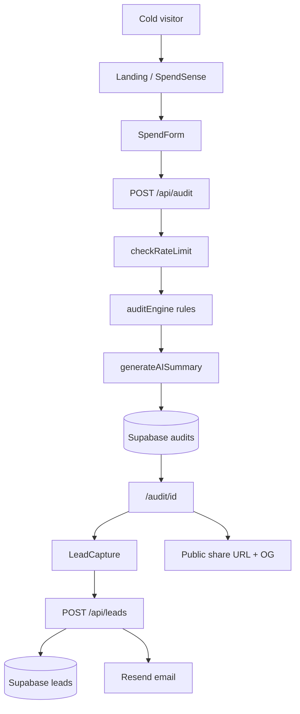

# SpendSense Architecture

Free AI spend audit web app — **SpendSense** (powered by Credex). No login required; email captured after value is shown.

## System flow

## Stack

| Layer | Technology |
|-------|------------|
| Frontend | Next.js 14 App Router, React, Tailwind, shadcn/ui |
| API | Next.js Route Handlers |
| Audit logic | Pure TypeScript (`auditEngine.ts`) |
| AI summary | Anthropic Claude API |
| Database | Supabase (Postgres) |
| Email | Resend |
| Deploy | Vercel |

## Key files

| Path | Role |
|------|------|
| `src/components/SpendForm.tsx` | Input form + localStorage |
| `src/lib/auditEngine.ts` | Rule-based recommendations |
| `src/lib/pricing.ts` | List prices (see `PRICING_DATA.md`) |
| `src/app/api/audit/route.ts` | Create audit |
| `src/app/api/leads/route.ts` | Capture lead + send email |
| `src/app/audit/[id]/page.tsx` | Results + OG metadata |
| `src/lib/supabase.ts` | DB + rate limit helpers |

## Environment variables

| Variable | Required | Purpose |
|----------|----------|---------|
| `NEXT_PUBLIC_SUPABASE_URL` | Prod | Supabase project URL |
| `NEXT_PUBLIC_SUPABASE_ANON_KEY` | Prod | Public read for shared audits |
| `SUPABASE_SERVICE_ROLE_KEY` | Prod | Server insert (audits, leads, rate limits) |
| `ANTHROPIC_API_KEY` | Optional | AI summary; template fallback if missing |
| `RESEND_API_KEY` | Optional | Confirmation email; skips send if missing |
| `NEXT_PUBLIC_APP_URL` | Prod | OG URLs and share links |

Local dev without Supabase uses an **in-memory fallback** in `src/lib/supabase.ts` (audits lost on restart).

## Abuse protection

| Control | Where | Why |
|---------|-------|-----|
| **Honeypot `website`** | Audit form → `POST /api/audit` | Bots fill hidden fields; returns fake success |
| **Honeypot `phone`** | Lead form → `POST /api/leads` | Same pattern for lead spam |
| **Rate limit 10/IP/hour** | `checkRateLimit` in Supabase | Stops audit API abuse; fails open on DB error |

Documented choice: honeypot + rate limit (no hCaptcha) — low friction for a free lead-gen tool while blocking naive bots.

## Data model

- **audits** — public read (share URL); no email stored on audit row
- **leads** — email + optional company/role; linked by `audit_id`
- **rate_limits** — IP window counters

Public `/audit/[id]` shows tools and savings only — PII stays in `leads`.

## Share / viral loop

Each audit gets `nanoid(10)` id. `generateMetadata` sets Open Graph + Twitter card with savings headline for link previews. Per-audit OG images are generated at [`src/app/audit/[id]/opengraph-image.tsx`](src/app/audit/[id]/opengraph-image.tsx) via `next/og`.

---

## What would change at 10,000 audits per day

Current architecture is correct for launch (single Vercel region, Supabase free/pro, synchronous audit API). At ~10k audits/day (~7/min average, spikes to 50+/min), these changes become necessary:

### Read path (share URLs)

- **Edge-cache audit pages.** `/audit/[id]` is immutable after creation. Add `export const revalidate = 3600` or `Cache-Control: public, s-maxage=3600, stale-while-revalidate=86400` so repeat views of viral audits do not hit Supabase.
- **CDN for OG images.** `opengraph-image` routes are CPU-bound; cache the PNG at the edge (Vercel automatically caches `opengraph-image` responses when headers allow).

### Write path (audit creation)

- **Async audit pipeline.** Today `POST /api/audit` blocks on Anthropic (~1–2s) + Supabase insert. At scale, return `202` with `auditId` immediately after the rule engine runs; enqueue Anthropic summary + DB write via Vercel Queues or Inngest. Client polls `/api/audit/[id]/status` or uses SSE.
- **Idempotency key.** Hash `(tools, teamSize, useCase)` to dedupe identical audits within 24h — cuts Anthropic cost and DB churn from refresh-spam.

### Database

- **Indexes:** `audits(created_at DESC)`, `leads(audit_id)`, `rate_limits(ip)` — already partially covered; verify query plans under load.
- **Partition `audits` by month** after ~100k rows to keep index size bounded.
- **Move rate limiting to Redis.** Replace Postgres `rate_limits` with Upstash Redis sliding-window counters (sub-ms, native TTL, no fail-open race on concurrent writes).

### AI cost control

- Anthropic at ~$0.005/audit × 10k/day ≈ **$50/day** ($1.5k/mo).
- Mitigations: cap summaries at 120 tokens (already), cache summaries for identical stacks, batch off-peak re-generation, hard daily budget alert at $100/day.

### Email

- Resend free tier = 3k emails/mo. At 45% capture × 10k audits/day ≈ 135k emails/mo — requires **Resend Pro** or **AWS SES** (~$0.10/1k).
- Add idempotency on `(audit_id, email)` to prevent duplicate sends on double-submit.

### Observability

- Vercel Analytics for traffic + Web Vitals.
- Structured logging per route: `audit.created`, `audit.saved`, `lead.captured`, `anthropic.fallback`.
- Alert on: 5xx rate > 1%, p95 audit latency > 3s, Supabase insert failures > 0.1%.

### Cost ceiling (rough)

| Service | Monthly at 10k audits/day |
|---------|---------------------------|
| Vercel Pro | ~$20 |
| Supabase Pro | ~$25 |
| Anthropic API | ~$1,500 |
| Resend Pro | ~$20 |
| Upstash Redis | ~$10 |
| **Total** | **~$1,575/mo** |

Against ~$7.30 expected value per captured email ([`ECONOMICS.md`](ECONOMICS.md)), the unit economics still work if qualified-lead volume holds — but infra cost dominates and must be monitored weekly.
