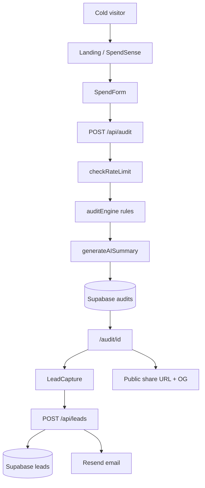

# SpendSense Architecture

Free AI spend audit web app — **SpendSense** (powered by Credex). No login required; email captured after value is shown.

## System flow

## Stack

| Layer | Technology |
|-------|------------|
| Frontend | Next.js 14 App Router, React, Tailwind, shadcn/ui |
| API | Next.js Route Handlers |
| Audit logic | Pure TypeScript (`auditEngine.ts`) |
| AI summary | Anthropic Claude API |
| Database | Supabase (Postgres) |
| Email | Resend |
| Deploy | Vercel |

## Key files

| Path | Role |
|------|------|
| `src/components/SpendForm.tsx` | Input form + localStorage |
| `src/lib/auditEngine.ts` | Rule-based recommendations |
| `src/lib/pricing.ts` | List prices (see `PRICING_DATA.md`) |
| `src/app/api/audit/route.ts` | Create audit |
| `src/app/api/leads/route.ts` | Capture lead + send email |
| `src/app/audit/[id]/page.tsx` | Results + OG metadata |
| `src/lib/supabase.ts` | DB + rate limit helpers |

## Environment variables

| Variable | Required | Purpose |
|----------|----------|---------|
| `NEXT_PUBLIC_SUPABASE_URL` | Prod | Supabase project URL |
| `NEXT_PUBLIC_SUPABASE_ANON_KEY` | Prod | Public read for shared audits |
| `SUPABASE_SERVICE_ROLE_KEY` | Prod | Server insert (audits, leads, rate limits) |
| `ANTHROPIC_API_KEY` | Optional | AI summary; template fallback if missing |
| `RESEND_API_KEY` | Optional | Confirmation email; skips send if missing |
| `NEXT_PUBLIC_APP_URL` | Prod | OG URLs and share links |

Local dev without Supabase uses an **in-memory fallback** in `src/lib/supabase.ts` (audits lost on restart).

## Abuse protection

| Control | Where | Why |
|---------|-------|-----|
| **Honeypot `website`** | Audit form → `POST /api/audit` | Bots fill hidden fields; returns fake success |
| **Honeypot `phone`** | Lead form → `POST /api/leads` | Same pattern for lead spam |
| **Rate limit 10/IP/hour** | `checkRateLimit` in Supabase | Stops audit API abuse; fails open on DB error |

Documented choice: honeypot + rate limit (no hCaptcha) — low friction for a free lead-gen tool while blocking naive bots.

## Data model

- **audits** — public read (share URL); no email stored on audit row
- **leads** — email + optional company/role; linked by `audit_id`
- **rate_limits** — IP window counters

Public `/audit/[id]` shows tools and savings only — PII stays in `leads`.

## Share / viral loop

Each audit gets `nanoid(10)` id. `generateMetadata` sets Open Graph + Twitter card with savings headline for link previews.
