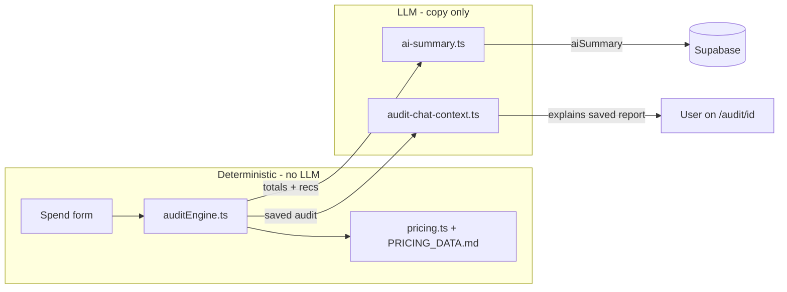

# PROMPTS.md — AI Thinking Doc (SpendSense)

## Purpose

This document records every **production** LLM prompt in SpendSense, why each is structured that way, what we tried and reverted, and how the app fails safely when OpenAI is unavailable. It is meant to show prompt-engineering judgment and clear boundaries — not that we used AI everywhere.

## Core principle

**AI assists explanation; it does not perform financial reasoning.**

All dollar amounts, plan choices, seat logic, and `isHighSavings` (> $500/mo) come from deterministic TypeScript in [`src/lib/auditEngine.ts`](src/lib/auditEngine.ts) against [`src/lib/pricing.ts`](src/lib/pricing.ts) and [`PRICING_DATA.md`](PRICING_DATA.md). OpenAI (`gpt-4o-mini`) only:

1. Writes the ~100-word results-page summary from **engine-provided facts**
2. Answers follow-up questions about a **saved** audit report (loaded from Supabase)

Totals never change after the LLM step.

## Design principles (why structured this way)

- **System prompt = voice and constraints** — short, stable, low token cost; does not carry audit facts.
- **User prompt = facts injected from the engine** — savings and top recommendations are precomputed; the model must not invent numbers.
- **Chat system prompt = guardrails + serialized audit context** — immutable report embedded in prose; chat does not call `runAudit()` or write to the database.
- **Fail-open for narrative, fail-closed for abuse** — missing or failing OpenAI → template summary or static chat reply; the audit still saves. Rate limits on audit creation and chat still return 429 when exceeded.
- **Honest UI** — `summarySource` (`"ai"` | `"template"`) is persisted and shown as a badge so users are not misled when the key is missing.

## Boundaries

| Layer | Does | Does not |
|-------|------|----------|
| `auditEngine.ts` | Compute savings, plans, recommendations, `isHighSavings` | Call OpenAI |
| `ai-summary.ts` | Polish a ~100-word CFO paragraph from engine facts | Recalculate savings, pick plans, change stored totals |
| Audit chat (`audit-chat-context.ts`) | Explain `reason` strings and saved totals | Invent prices, rerun audit, alter Supabase rows |
| `PRICING_DATA.md` + `pricing.ts` | Source of list prices and vendor URLs | — |

## Where LLMs sit in the pipeline



| Feature | Implementation |
|---------|----------------|
| One-shot personalized summary | `src/lib/ai-summary.ts` |
| Audit results chat widget | `src/app/api/audit/[id]/chat/route.ts` + `src/lib/audit-chat-context.ts` |
| Shared OpenAI client | `src/lib/openai-client.ts` |

---

## Production prompt 1 — AI summary

### Model

- **Provider:** OpenAI
- **Model:** `gpt-4o-mini` (overridable via `OPENAI_MODEL` env var)
- **max_tokens:** 200 (summary), default temperature (not overridden)

### System prompt

Exact string from [`src/lib/ai-summary.ts`](src/lib/ai-summary.ts):

```
You are a concise financial analyst. Direct, specific. No fluff. No sales pitch. Under 120 words. Plain paragraph, no bullets.
```

### User prompt template

Built by `generateAuditSummaryPrompt()` in [`src/lib/auditEngine.ts`](src/lib/auditEngine.ts):

```
Write a ~100-word paragraph for a startup {useCase} team of {teamSize}.
Total potential savings: ${totalMonthlySavings}/month (${totalAnnualSavings}/year).
Top recommendations: {top 2 recs with $/mo each, or "stack appears well-optimized"}.
Tone: direct, CFO-style, no bullets, no hype.
{If isHighSavings (> $500/mo): append sentence to mention Credex discounted infrastructure credits}
```

When `isHighSavings` is true, the code appends:

```
 Mention Credex discounted infrastructure credits as an option to capture additional savings.
```

### Example filled user prompt

```
Write a ~100-word paragraph for a startup coding team of 5.
Total potential savings: $120/month ($1440/year).
Top recommendations: Cursor: Downgrade to Cursor Pro ($20/mo); Claude: Switch to Claude Pro for 2 seat(s) ($70/mo).
Tone: direct, CFO-style, no bullets, no hype.
```

---

## Failure behavior (summary)

| Condition | Behavior |
|-----------|----------|
| `OPENAI_API_KEY` missing | Template fallback (`buildFallbackSummary`); `summarySource: "template"` |
| API error / non-200 / rate-limited | Same template fallback |
| Response is empty / non-text | Same template fallback |
| User-facing error | None — the page always renders a readable paragraph |

### Fallback template logic (`buildFallbackSummary`)

- **Savings < $100/mo:** Honest "stack looks largely right-sized" + notify-me framing.
- **Savings ≥ $100/mo:** Total spend, top recommendation with $, annual savings.
- **`isHighSavings` (> $500/mo):** Append a single Credex consultation sentence.

### Transparency: `summarySource`

Saved on each audit and shown on the results page ([`audit-results.tsx`](src/components/audit/audit-results.tsx)):

| Value | Badge |
|-------|-------|
| `"ai"` | Generated by OpenAI |
| `"template"` | Rule-based summary |

Users can tell when the narrative is deterministic, not GPT-polished.

The fallback is good enough that the LLM is really only adding tone polish, not new information — which is the right architecture when reliability matters more than novelty.

---

## Failed prompts and reverted experiments

### Failed prompt (v0 — killed)

Early draft: one LLM call did **audit math + summary**. Verbatim shape (reconstructed from first implementation):

**System:**

```
You are an AI spend auditor for startup teams. Be direct and specific.
```

**User:**

```
Analyze this AI tool stack, identify overspend, recommend plan or seat changes with monthly savings in dollars, and write a short summary paragraph.

Team: {teamSize} people, use case: {useCase}

Stack:
- tool: cursor, plan: business, seats: 5, monthlySpend: 200
- tool: chatgpt, plan: team, seats: 4, monthlySpend: 120
- tool: anthropic-api, plan: api, seats: 1, monthlySpend: 800
...

Return recommendations with savings amounts and a human-readable summary.
```

**Observed hallucinations (why it was killed):**

- ChatGPT Team seat minimum: model said **3 seats**; vendor minimum is **2**
- Invented a Cursor **"Startup"** plan that does not exist in our catalog
- Claimed specific Anthropic API savings **"by switching to OpenAI"** with no pricing basis

All dollars now come from `auditEngine.ts` + `PRICING_DATA.md`. The LLM only writes the human paragraph.

### Other experiments reverted (summary path)

**Asking for bullets / structured output.**
Tried `respond as JSON with {headline, body, cta}`. JSON was valid but the body sounded mechanical and lost the CFO voice. Reverted to plain paragraph, no bullets.

**Few-shot examples in the system prompt.**
Two example input/output pairs raised cost ~40% and outputs copied example sentences too literally. Removed; single-line system + structured user prompt gives better variety.

**Higher `max_tokens`.**
Tried 400. Summaries padded with "In summary, ..." restatements. Capped at 200.

**Streaming the response.**
Word-by-word display made the report feel slower (users waited for the full paragraph before sharing). Reverted to single-shot server render — screenshot-ready immediately.

---

## Production prompt 2 — Audit chat widget

Floating assistant on `/audit/[id]`. Answers follow-up questions about the **saved audit** from Supabase — does not re-run `runAudit()` or invent new dollar amounts.

**Note:** [`audit-chat-widget.tsx`](src/components/audit/audit-chat-widget.tsx) defines `STARTER_PROMPTS` ("What should I do first?", etc.). Those are **UI chip hints** sent as user messages, not LLM system prompts.

### Model and limits

- Same provider/model: OpenAI `gpt-4o-mini` (`OPENAI_MODEL` optional)
- **max_tokens:** 300 per reply
- **Rate limit:** `checkRateLimit(ip)` — 10 requests/hour/IP (same as `POST /api/audit`)
- **Session cap:** 6 user messages per page visit (client-side cost/abuse guard)
- **History cap:** 12 messages max per API request; 2000 chars per message

### System prompt guardrails

Exact string from [`src/lib/audit-chat-context.ts`](src/lib/audit-chat-context.ts) (`CHAT_GUARDRAILS`):

```
You are SpendSense's audit assistant. Answer only about THIS saved audit report.
Rules:
- Use only dollar amounts, plans, and recommendations listed in the audit context below.
- Never invent new savings figures, list prices, or vendor plans.
- If asked to recalculate or change numbers, say the report above is the source of truth.
- Keep replies under 120 words. Plain sentences, no markdown bullets unless the user asks for a list.
- Be direct and helpful; no sales hype except briefly mentioning Credex when isHighSavings is true and the user asks about it.
```

`buildAuditChatSystemPrompt()` appends the audit context block (team, tools, recommendations, totals, `isHighSavings`, stored `aiSummary`).

### Example filled system prompt (abbreviated audit id)

```
You are SpendSense's audit assistant. Answer only about THIS saved audit report.
Rules:
- Use only dollar amounts, plans, and recommendations listed in the audit context below.
- Never invent new savings figures, list prices, or vendor plans.
- If asked to recalculate or change numbers, say the report above is the source of truth.
- Keep replies under 120 words. Plain sentences, no markdown bullets unless the user asks for a list.
- Be direct and helpful; no sales hype except briefly mentioning Credex when isHighSavings is true and the user asks about it.

AUDIT CONTEXT (immutable report id: abc123-def456)
Team: 5 people, use case: coding
Total potential savings: $190/month ($2280/year)
High savings (Credex eligible): no

Tools submitted:
- cursor: plan=business, spend=$200/mo, seats=5
- chatgpt: plan=team, spend=$120/mo, seats=4

Top recommendations by savings:
- Cursor: Downgrade to Cursor Pro — save $20/mo. Reason: Business plan seats exceed team size; Pro covers individual use at lower list price.
- ChatGPT: Reduce to Team minimum seats — save $40/mo. Reason: Team plan requires minimum 2 seats; you have 4 billed.

All recommendations:
- Cursor (business, $200/mo): Downgrade to Cursor Pro [downgrade] savings=$20/mo — ...
- ChatGPT (team, $120/mo): Reduce to 2 seats [seat-rightsize] savings=$40/mo — ...

Saved personalized summary:
Across 2 tools (~$320/month), we identified $190/month ...
```

### API and chat fallback

- `POST /api/audit/[id]/chat` body: `{ messages: { role: "user" | "assistant", content: string }[] }`
- Returns `{ reply: string }`
- Missing key, API failure, or empty reply → constant from [`chat/route.ts`](src/app/api/audit/[id]/chat/route.ts):

```
I can't reach the assistant right now. Your audit numbers above are still valid.
```

Audit numbers on the page remain authoritative; chat is optional explanation.

---

## What a reviewer should conclude

SpendSense treats LLMs as a **tone and Q&A layer** on top of traceable rules. Financial reasoning lives in TypeScript with vendor URLs; OpenAI polishes prose and explains precomputed `reason` strings. When the API is down, deterministic fallbacks and honest `summarySource` labeling keep the product usable without pretending AI ran. That split is deliberate: credibility for finance reviewers matters more than maximal AI surface area.
