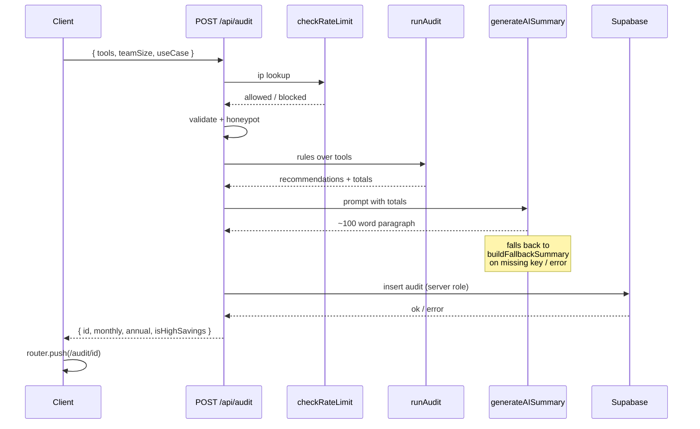
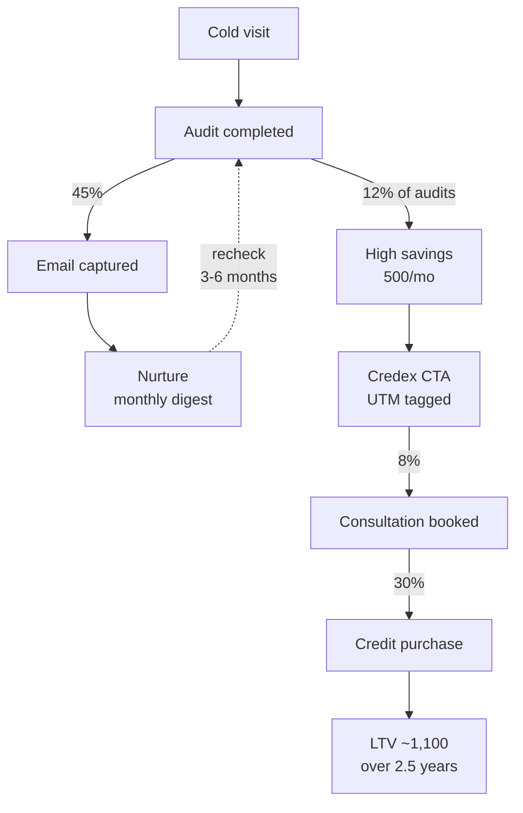
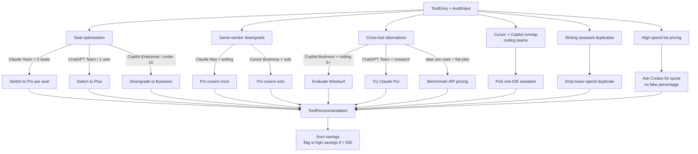
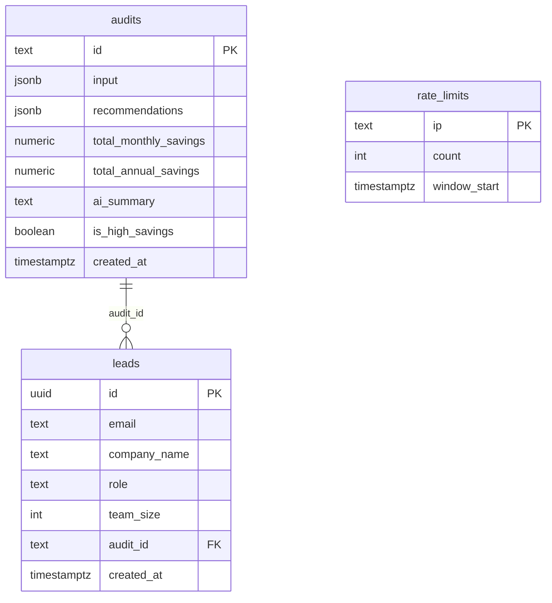

# SpendSense

> A free 3-minute audit of a startup's AI tool stack. Finds overspend on Cursor, Claude, ChatGPT, Copilot, Gemini, and more — with defensible list-price math your finance team will believe. Built as a lead-generation product for [Credex](https://credex.rocks), which sells discounted AI infrastructure credits.

**Live:** https://credex-intern.vercel.app
**Stack:** Next.js 14 App Router · TypeScript strict · Tailwind · shadcn/ui · Supabase · Anthropic Claude · Resend · Vercel
**Tests:** 36 passing (Vitest unit + integration, Playwright e2e + axe-core a11y)

> Audits and leads persist only after Supabase keys are set in Vercel → Settings → Environment Variables. Walkthrough in [`docs/DAY3_QUICKSTART.md`](docs/DAY3_QUICKSTART.md).

---

## Why this exists

Most startups overspend on AI tools by 20-40% — wrong plan, wrong seat count, duplicate tools, or paying full list price when discounted credits are available. There is no Mint for AI tool spend. SpendSense is that tool: a screenshotable savings number in under three minutes, with every dollar traceable to a vendor pricing URL.

For users with >$500/month in surfaced savings, Credex (the company behind SpendSense) sells discounted AI infrastructure credits sourced from companies that overforecast. The audit is free and useful regardless; Credex is the qualified-lead capture, not the gate.

---

## End-to-end user flow

```mermaid
flowchart LR
  visitor[Cold visitor<br/>HN / X / blog] --> landing[Landing<br/>hero + sample preview]
  landing --> form[Tool palette form<br/>localStorage persisted]
  form --> auditAPI["POST /api/audit"]
  auditAPI --> rateLimit{rate limit<br/>10/IP/hour}
  rateLimit -->|allowed| honeypot{honeypot<br/>website field}
  rateLimit -->|blocked| err429[429]
  honeypot -->|filled| fakeId[fake id<br/>no DB write]
  honeypot -->|empty| engine[auditEngine<br/>rules + list prices]
  engine --> ai[generateAISummary<br/>Anthropic or template]
  ai --> save[(Supabase<br/>audits)]
  save --> redirect[/audit/id]
  redirect --> hero[SavingsHero<br/>monthly + annual]
  hero --> breakdown[AuditResults<br/>per-tool timeline]
  breakdown --> highSavings{savings > 500/mo?}
  highSavings -->|yes| credexCta[Credex CTA<br/>UTM-tagged]
  highSavings -->|no| honest[honest copy<br/>spending well]
  breakdown --> lead[LeadCapture<br/>email after value]
  lead --> leadsAPI["POST /api/leads"]
  leadsAPI --> leadsDB[(Supabase<br/>leads)]
  leadsAPI --> resend[Resend<br/>transactional email]
  redirect --> share[Share URL + OG<br/>dynamic per-audit image]
```

---

## Audit pipeline (server-side)



---

## Lead-gen funnel (Credex revenue path)



See [`ECONOMICS.md`](ECONOMICS.md) for the underlying math (lead value ~$7.30/email, CAC by channel, $1M ARR scenario).

---

## Audit engine logic (what the rules actually do)



Every rule traces to a list price in [`PRICING_DATA.md`](PRICING_DATA.md) and is unit-tested in [`src/lib/auditEngine.test.ts`](src/lib/auditEngine.test.ts).

---

## Data model and RLS posture



- **audits** — public read (anon + authenticated). No PII on this table.
- **leads** — no public policies. Service role only.
- **rate_limits** — service role only.

Schema lives at [`supabase/schema.sql`](supabase/schema.sql). RLS posture is tested in [`tests/unit/rls-policy.test.ts`](tests/unit/rls-policy.test.ts).

---

## Screenshots

> Capture from the live URL on mobile (Chrome DevTools → iPhone 14 preset → "Capture full size screenshot"). Save to `docs/screenshots/`.

| What | File | Status |
|------|------|--------|
| Landing — hero + sample preview + how-it-works | `docs/screenshots/landing.png` | pending |
| Audit result — savings hero + per-tool breakdown | `docs/screenshots/audit-high-savings.png` | pending |
| Optimized stack — honest path | `docs/screenshots/audit-optimized.png` | pending |
| Lead capture — email after value | `docs/screenshots/lead.png` | pending |
| OG preview at opengraph.xyz | `docs/screenshots/og-preview.png` | pending |

Capture instructions: [`docs/screenshots/README.md`](docs/screenshots/README.md).

---

## Quick start

```bash
nvm use 20
npm install
cp .env.example .env.local
# Fill in keys — see docs/KEYS_CHECKLIST.md
npm run dev
```

Open [http://localhost:3000](http://localhost:3000).

| Service | Where to get the key | Env var(s) |
|---------|----------------------|------------|
| Supabase | supabase.com → New project → Settings → API | `NEXT_PUBLIC_SUPABASE_URL`, `NEXT_PUBLIC_SUPABASE_ANON_KEY`, `SUPABASE_SERVICE_ROLE_KEY` |
| Anthropic | console.anthropic.com → API Keys | `ANTHROPIC_API_KEY` (optional override: `ANTHROPIC_MODEL`) |
| Resend | resend.com → API Keys (free tier) | `RESEND_API_KEY` |

Apply the schema in Supabase SQL Editor: paste [`supabase/schema.sql`](supabase/schema.sql) → Run.

```bash
npm run verify:env       # all required vars set
npm run test:supabase    # round-trip insert + read
npm run dev              # http://localhost:3000
```

---

## Deploy (Vercel)

```bash
npx vercel link          # one-time
npx vercel --prod
```

After the first deploy, set every variable from `.env.example` in Vercel → Settings → Environment Variables. Set `NEXT_PUBLIC_APP_URL` to the production URL (no trailing slash) for OG previews and email links to be correct. Redeploy:

```bash
npx vercel --prod
```

Full walkthrough: [`docs/DAY3_QUICKSTART.md`](docs/DAY3_QUICKSTART.md). Production verification log: [`docs/VERIFY_PROD.md`](docs/VERIFY_PROD.md).

---

## Decisions (5 trade-offs and why)

1. **Hardcoded rules for audit math, LLM only for the summary paragraph.** Finance teams need numbers that trace to a vendor URL. LLMs hallucinate prices and seat minimums. Rules in [`src/lib/auditEngine.ts`](src/lib/auditEngine.ts) + sourced numbers in [`PRICING_DATA.md`](PRICING_DATA.md) are the defensible split; the ~100-word Claude summary in [`src/lib/anthropic.ts`](src/lib/anthropic.ts) is reserved for narrative tone, not math.

2. **In-memory fallback in [`src/lib/supabase.ts`](src/lib/supabase.ts) for local dev only.** Lets the dev loop run without a Supabase project, but the route now returns 503 if `saveAudit` fails on a configured deploy, and a loud warning fires when `SUPABASE_SERVICE_ROLE_KEY` is missing in production. Serverless functions don't share memory across requests, so "memory fallback in prod" is a silent landmine — not a feature.

3. **Honeypot + rate limit instead of hCaptcha.** This is a free public lead-gen tool — every step of friction kills the conversion rate. Honeypot fields (`website` on the audit form, `phone` on the lead form) catch naive bots; a Supabase-backed 10/IP/hour rate limit catches abuse. Rate limit fails open if Supabase is down — deliberate trade-off documented in [`ARCHITECTURE.md`](ARCHITECTURE.md). hCaptcha is for if real abuse surfaces.

4. **Email gate placed strictly after value is shown.** Every cold visitor sees the full savings number and per-tool breakdown on `/audit/[id]` *before* the lead form. The brief says the email gate should never come before value. Conversion suffers a little; lead quality jumps a lot, and a captured email is qualified by self-selection.

5. **"You're spending well" honest path for zero-savings audits.** For audits at $0/month savings, the page surfaces a plain "your stack is right-sized" message instead of manufacturing savings to justify a Credex CTA. Honest dead-ends protect Credex's brand, produce warmer leads later when the same user's stack grows, and the audit reads as a finance memo not a sales asset.

---

## Tests

```bash
npm test                 # 36 tests across 7 files
npm run test:e2e         # Playwright (requires `npx playwright install chromium`)
npm run smoke            # HTTP smoke against a running server
```

| Layer | Files | Tests |
|-------|-------|-------|
| Audit engine | `src/lib/auditEngine.test.ts` | 7 |
| Pricing | `src/lib/pricing.test.ts` | 4 |
| Validation | `tests/unit/validation.test.ts` | 11 |
| AI summary fallback | `tests/unit/summary-fallback.test.ts` | 3 |
| RLS schema | `tests/unit/rls-policy.test.ts` | 3 |
| API audit | `tests/integration/api-audit.test.ts` | 3 |
| API lead capture | `tests/integration/api-lead-capture.test.ts` | 4 |
| E2E + a11y | `tests/e2e/*.spec.ts` | 3 |

Coverage map: [`TESTS.md`](TESTS.md). Cross-check against the assignment: [`docs/CROSSCHECK.md`](docs/CROSSCHECK.md).

---

## Project structure

```
src/
  app/
    api/
      audit/route.ts            POST /api/audit
      leads/route.ts            POST /api/leads
    audit/[id]/
      page.tsx                  results page (server component, revalidate 3600)
      opengraph-image.tsx       dynamic per-audit OG image
    opengraph-image.tsx         landing OG image
    layout.tsx                  metadata + ThemeProvider
    page.tsx                    landing
    globals.css                 tailwind tokens + aurora keyframes
  components/
    SpendForm.tsx               tool palette + drag-drop + localStorage
    AuditResults.tsx            per-tool timeline
    SavingsHero.tsx             sticky monthly/annual hero
    LeadCapture.tsx             email-after-value form
    ShareSection.tsx            copy link + tweet draft
    spend-form/                 tool-card, stack-card, empty-stack
    layout/                     page-shell, site-header, site-footer
    ui/                         shadcn primitives + brand
  lib/
    auditEngine.ts              rule engine (server-pure)
    pricing.ts                  list prices (mirror of PRICING_DATA.md)
    anthropic.ts                ~100 word summary + template fallback
    supabase.ts                 audits / leads / rate_limits helpers (server-only)
    validation.ts               shared input validation
  types/
    index.ts                    AuditInput, AuditResult, ToolEntry, etc.
supabase/schema.sql             tables + RLS
tests/                          unit + integration + e2e
scripts/                        verify-env, test-supabase, smoke-e2e
docs/                           DAY3_QUICKSTART, CROSSCHECK, SUBMISSION_REVIEW
```

---

## Scripts

| Command | What it does |
|---------|--------------|
| `npm run dev` | Local development on :3000 |
| `npm run build` | Production build |
| `npm run start` | Serve the production build |
| `npm run lint` | ESLint |
| `npm run typecheck` | `tsc --noEmit` |
| `npm test` | Vitest — 36 unit + integration tests |
| `npm run test:e2e` | Playwright — journey, OG, a11y |
| `npm run verify:env` | Confirms `.env.local` keys are non-empty |
| `npm run test:supabase` | Insert + read round-trip against your Supabase |
| `npm run smoke` | HTTP-level smoke against a running server |

---

## Docs

### Engineering

| File | Purpose |
|------|---------|
| [`ARCHITECTURE.md`](ARCHITECTURE.md) | Stack, diagrams, abuse rationale, 10k audits/day scale-out |
| [`DEVLOG.md`](DEVLOG.md) | Daily log in the required `Day N — YYYY-MM-DD` format |
| [`REFLECTION.md`](REFLECTION.md) | 5 required questions answered |
| [`TESTS.md`](TESTS.md) | What's tested, how to run |
| [`PRICING_DATA.md`](PRICING_DATA.md) | Every list price with a vendor URL and verified date |
| [`PROMPTS.md`](PROMPTS.md) | Anthropic prompt + fallback + what we tried that didn't work |

### Entrepreneurial

| File | Purpose |
|------|---------|
| [`GTM.md`](GTM.md) | Target user, specific channels, first-100-users plan, unfair channel |
| [`ECONOMICS.md`](ECONOMICS.md) | Lead value, CAC per channel, $1M ARR scenario |
| [`USER_INTERVIEWS.md`](USER_INTERVIEWS.md) | Real conversation log + outreach scripts |
| [`LANDING_COPY.md`](LANDING_COPY.md) | Hero, sub, CTAs, FAQ, social proof, X thread |
| [`METRICS.md`](METRICS.md) | North Star, 3 input metrics, what triggers a pivot |

### Operations

| File | Purpose |
|------|---------|
| [`docs/DAY3_QUICKSTART.md`](docs/DAY3_QUICKSTART.md) | The fastest path to a live URL |
| [`docs/SUPABASE_SETUP.md`](docs/SUPABASE_SETUP.md) | Supabase setup walkthrough |
| [`docs/DEPLOY.md`](docs/DEPLOY.md) | Vercel deploy walkthrough |
| [`docs/KEYS_CHECKLIST.md`](docs/KEYS_CHECKLIST.md) | Every env var with where to get it |
| [`docs/CROSSCHECK.md`](docs/CROSSCHECK.md) | Self-audit against the assignment |
| [`docs/VERIFY_PROD.md`](docs/VERIFY_PROD.md) | Production smoke results |
| [`docs/SUBMISSION_REVIEW.md`](docs/SUBMISSION_REVIEW.md) | Assignment-checklist walkthrough |
| [`docs/task3.md`](docs/task3.md) | Day 3 task tracker |

---

## License

MIT. Built for the Credex Web Development Intern Assignment Round 1.
